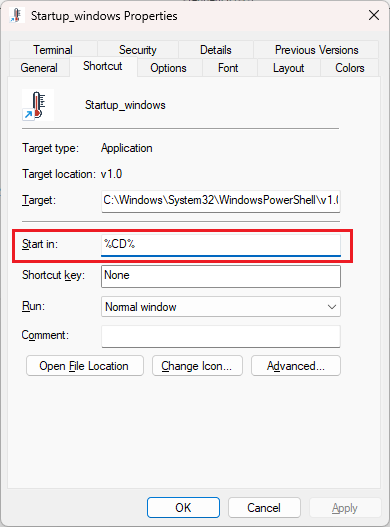

# PicoLog TC-08 temperature logging Python software for Sr3 use
- Created by Joonseok Hur
- 2024/06/23: last modified by Joonseok Hur

## Functions
Periodically read temps and upload it to Sr group's Grafana's DB

## Initial setup
1. Install Miniforge (prefered; https://github.com/conda-forge/miniforge) or Miniconda (https://docs.conda.io/projects/miniconda/en/latest/).
2. Open VSCode, open this folder in VSCode, and create conda environment in VSCode
    - Command Palette (Ctrl+Shift+P) -> Python: Create Environment... -> Conda
    - **For Windows**, Go to Command Palette (Ctrl+Shift+P) -> Preferences: Open User Settings (JSON) and add the following item in the opened `setting.json` file, to avoid PowerShell from blocking `$PROFILE` `.ps1` file from running (corresponding to `.bashrc` file for `bash`) and thus preventing conda environment from being activated:
        ```JSON
        "terminal.integrated.profiles.windows": {
            "PowerShell": {
                "source": "PowerShell",
                "icon": "terminal-powershell",
                "args": ["-ExecutionPolicy", "Bypass"],
            }
        },
        "terminal.integrated.defaultProfile.windows": "PowerShell",
        ```
3. Open `runtest.py` and press `F5` key to let PowerShell terminal opened in VSCode and the conda environment are activated.
4. Install `picosdk`, the SDK for Pico devices, and the Python wrapper, following the instruction in README of `picosdk-python-wrappers` github repo: https://github.com/picotech/picosdk-python-wrappers, depending on the OS. The below is the brief instructuion as of 06/23/2024.
    1. Installing `picosdk`:
        - Windows: 
            1. Download `PicoSDK_64_10.7.26.362.exe` from https://www.picotech.com/downloads.
            2. Run the `.exe` file to install `picosdk'
        - Ubuntu: run the below command lines in `bash` terminal:
            ```bash
            sudo bash -c 'wget -O- https://labs.picotech.com/Release.gpg.key | gpg --dearmor > /usr/share/keyrings/picotech-archive-keyring.gpg'
            sudo bash -c 'echo "deb [signed-by=/usr/share/keyrings/picotech-archive-keyring.gpg] https://labs.picotech.com/rc/picoscope7/debian/ picoscope main" >/etc/apt/sources.list.d/picoscope7.list'
            sudo apt update
            sudo apt install libusbtc08
            ```
    2. Installing python wapper package
        1. Download the `picosdk-python-wrappers` github repo to a folder.
            ```bash
            cd <folder path>
            git clone https://github.com/picotech/picosdk-python-wrappers.git
            ```
            Install GIT (https://git-scm.com/) if it has not bean istalled!
        2. Activate the conda environment for Sr3 TC08 logging software.
            ```bash
            conda activate <path to Sr3 TC08 repo folder>/.conda
            ```
        3. Install the Python package in the conda env.
            ```bash
            cd picosdk-python-wrappers
            ```
            - Windows:
                ```
                pip install .
                ```
            - Linux:
                ```bash
                pip install . --user
                ```
                to install for the current user only, or
                ```bash
                sudo pip install .
                ```
        4. Run `conda list` and check if the `picosdk` package is successfully installed (over pypi).
    (Optional) installing a GUI software named PicoLog https://www.picotech.com/downloads for the OS will help checking the connection to and features of TC-08 device.
5. Run `conda install -r requirements` in the terminal to install required Python packages.
    - If Raspberry Pi 3B+ is used, do not use any Conda distributions and instead do everything in `venv` with system's `python`.
    - The 64-bit ARM architecture (aach64) for Raspberry Pi 4B is not supported by Pico Technology (as of 2023/10/22; see https://www.picotech.com/support/viewtopic.php?t=42162)
6. Try running `picotest.py` script by pressing `F5` key to check if picosdk successfully read the temperature from the logger.
7. Run `python -m pip install influxdb-client` (or `conda install influxdb-client` for Miniforge).
8. Open `main.py` and setup `assingment` dict variable to assign `Location` (description of where the temp is being measured) and `Channel` (TC-08 logger's channel #) of temp measurements. Set measurement period to `period` variable with the unit of second. 
9. Try running `main.py` script by pressing `F5` key to check if the app runs as it should.
10. Check if a relevant way to start up the app in the next section works.

## Starting app
### Windows
Run (doubleclick) `.\Startup_windows.lnk` shortcut file. If the `.lnk` file is moved/copied out of the software folder (with `main.py`), change the `Start in` value from `%CD` to the absolute path of the software folder (e.g., `"%USERPROFILE%\PicoLog TC-80 temp logging\PicoLog-TC-80-temp-logging"`) in the Properties setting below:


Tested for Windows 11.

### Linux
Run `.\Startup_windows.lnk` in `./Startup_linux` file.
Has not been tested yet.

## Autostart setting at OS startup
### Windows
Modify the `.\Startup_windows.lnk` following [this section](#windows).
Copy the `.lnk` file to `%USERPROFILE%\AppData\Roaming\Microsoft\Windows\Start Menu\Programs\Startup`.

### Linux
cf. setting up autosart through GUI in Ubuntu: https://help.ubuntu.com/stable/ubuntu-help/startup-applications.html.en

## Use
It will start reading temps, print in stdout, and uploading to Grafana's DB periodically. 

## Developer's notes
- Files for initial setup are from the SDK example folder (../picosdk-python-wrappers-master/)
    - setup.py, .gitignore files and picosdk/ folder were copied here as-is.
    - README.md was copied as README_SDK.md and a corresponding change was made in setup.py (see top comments as a release note therein)
- main.py is the entry point and contain all the essential codes.
- The codes are developed from the TC-08 SINGLE MODE EXAMPLE in the SDK folder (../picosdk-python-wrappers-master/usbtc08Examples/tc08SingleModeExample.py).